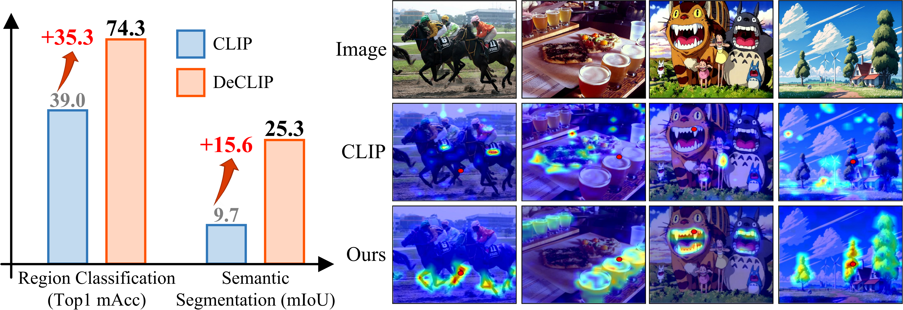
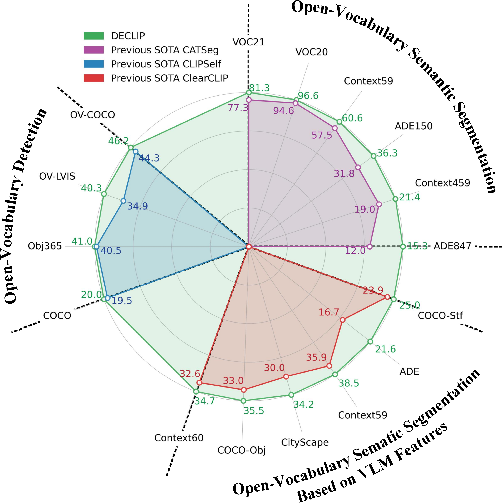

# DeCLIP: Decoupled Learning for Open-Vocabulary Dense Perception
This branch of the repository is the official PyTorch implementation of integrating [DeCLIP](https://arxiv.org/abs/2505.04410) in [CAT-Seg](https://arxiv.org/abs/2303.11797) model for open-vocabulary semantic segmentation.

## Contributions
<p align="center">
  
  
</p>

1. We analyze CLIP and find that its limitation in open-vocabulary dense prediction arises from **image tokens failing to aggregate information from spatially or semantically related regions**.
2. To address this issue, we propose DeCLIP, a simple yet effective unsupervised fine-tuning framework, to enhance the discriminability and spatial consistency of CLIP’s local features via **a decoupled feature enhancement strategy**.
3. DeCLIP outperforms previous state-of-the-art models on a broad range of open-vocabulary dense prediction benchmarks.

## 🌈Environment
- Linux with Python == 3.10.0
- CUDA 11.7 or CUDA 11.8
- The provided environment is suggested for reproducing our results, similar configurations may also work.

## 🚀Quick Start

### 1. Create Conda Environment
```
conda create -n DeCLIP_CATSeg python=3.10.0
conda activate DeCLIP_CATSeg
Install a torch that matches your CUDA version from the official website: https://pytorch.org/get-started/previous-versions/, The environment we are using is CUDA11.7+TORCH2.0.0.

pip install torch==2.0.0 torchvision==0.15.1 torchaudio==2.0.1
pip install -r requirements.txt
pip install -e . -v
```

### 2. Dataset Preparation
We follow CAT-Seg for preparing datasets. Thanks to the CAT-Seg's high-quality open source. Please use this [Link](https://github.com/cvlab-kaist/CAT-Seg/blob/main/datasets/README.md) to organize the dataset. Don't forget to set `os.environ["DETECTRON2_DATASETS"] = "path_to_your_dataset"` in `train_net.py`. For example: `os.environ["DETECTRON2_DATASETS"] = "/mnt/SSD8T/home/wjj/dataset".`

### 3. Training
Before starting the training, please modify the paths in the training config `configs/eva_vitb_384.yaml` and `eva_vitl_336.yaml`.

**Note:**  
In our current code, the default DeCLIP dense feature extraction method is set to `csa` (i.e., SCLIP, qq+kk). If your DeCLIP is distilled using the `qq` mode, please modify the input parameter of the `encode_dense` function to `mode='qq'` in two places in `cat_seg/cat_seg_model.py` (corresponding to training and inference, respectively).
``` 
CLIP_PRETRAINED: "EVA02-CLIP-B-16" 
CACHE_DIR: "path_to_your_declip_ckpt"
``` 

To train the DeCLIP with CAT-Seg, please run the following script:
``` 
sh run.sh [CONFIG] [NUM_GPUS] [OUTPUT_DIR] [OPTS]

# For DeCLIP-B variant
sh run.sh configs/eva_vitb_384.yaml 4 output/

# For DeCLIP-L variant
sh run.sh configs/eva_vitl_336.yaml 4 output/
```
### 4. Evaluation
```
sh run.sh [CONFIG] [NUM_GPUS] [OUTPUT_DIR] [OPTS]

# For DeCLIP-B variant
sh eval.sh configs/eva_vitb_384.yaml 4 output/ MODEL.WEIGHTS path/to/trained_weights.pth

# For DeCLIP-L variant
sh eval.sh configs/eva_vitl_336.yaml 4 output/ MODEL.WEIGHTS path/to/trained_weights.pth
```
## Results & Checkpoints  
| Name    | ADE847 | Context459 | ADE150 | Context59 | VOC20 |   VOC21   | Checkpoint |
| ------------- | :----: | :--------: | :----: | :-------: | :---: | :-------: | :--------: |
| CATSeg_DeCLIP_EVA-B_DINOv2-B_csa_0.05_2.0 | 15.20 |    21.47      |    36.57    |     60.89      |   96.68     |     81.54      | [CAT-Seg](https://huggingface.co/xiaomoguhzz/CATSeg_DeCLIP_EVA-B_DINOv2-B_csa_0.05_2.0/tree/main), [DeCLIP](https://huggingface.co/xiaomoguhzz/DeCLIP_EVA-B_DINOv2-B_csa_0.05_2.0)|

**Note:**  
Due to an accidental operation in VSCode, the originally trained checkpoint was permanently deleted. The current checkpoint provided here was retrained and may have slight differences compared to the one reported in the paper. However, the overall performance remains consistent. Thank you for your understanding.

## ❤️ Acknowledgement
Our work builds upon the method and codebase of [CLIPSelf](https://github.com/wusize/CLIPSelf), [ClearCLIP](https://github.com/mc-lan/ClearCLIP), [CAT-Seg](https://github.com/cvlab-kaist/CAT-Seg), [EVA-CLIP](https://github.com/baaivision/EVA/tree/master/EVA-CLIP), [OpenCLIP](https://github.com/mlfoundations/open_clip/tree/v2.16.0). We sincerely thank the authors for their remarkable contributions, which provided an essential foundation for our research.

## 🙏 Citing DeCLIP 

```bibtex
@article{wang2025declip,
  title={DeCLIP: Decoupled Learning for Open-Vocabulary Dense Perception},
  author={Wang, Junjie and Chen, Bin and Li, Yulin and Kang, Bin and Chen, Yichi and Tian, Zhuotao},
  journal={arXiv preprint arXiv:2505.04410},
  year={2025}
}
```